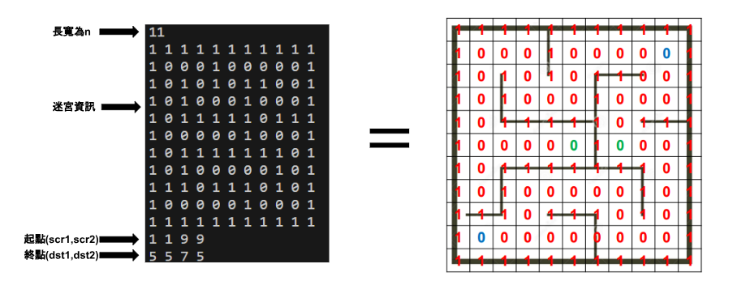
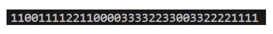

---
jupytext:
  cell_metadata_filter: -all
  formats: md:myst
  text_representation:
    extension: .md
    format_name: myst
    format_version: 0.13
    jupytext_version: 1.16.2
kernelspec:
  display_name: Python 3 (ipykernel)
  language: python
  name: python3
---

# Maze

> **基本資訊**  
> 程式語言: C  
> 程式網址: https://onlinegdb.com/A-29o4csX  
> 製作時長: 1 周  
> 作者: Hutaki Hare  

## 題目簡介 
給定一n*n之迷宮，0代表路1代表牆，輸入兩個點代表起點，兩個點為終點，兩起始點上點  
會同步移動，要試著找到最少的移動步數，使兩點都可到過終點，且兩起點須經過不同終點。  

## 運作方式
### 1.開始: 輸入迷宮資料

```
 scanf("%d",&num);    //scan maze size
  ... // other code
    //initiallize all nodes and scan maze type (wall or path)
    for(int row=num-1;row>=0;row--){
        for(int col=0;col<num;col++){
            scanf("%d",&maze1[col][row].type);
           ... // other code
        }
    }
    ...  // other code
    //scan scr and dst
    scanf("%d %d %d %d",&S1.col,&S1.row,&S2.col,&S2.row);
    scanf("%d %d %d %d",&D1.col,&D1.row,&D2.col,&D2.row);
```

  

### 2. 過程
 1. 利用P2P distance求得P1走個方向與二終點之距離，並由小到大排列為採取順序
```
double P2P_distance(int col,int row,position* D){ //calculating for two points' distance
    return fabs(col-D->col)+fabs(row-D->row);
}
...  // other code
void find_way_1(int num,position* P1,position* P2,position * D1,position * D2, route*** maze1,route*** maze2){
  ...
  for(int i=0;i<4;i++){  // loop for four direction
      if(((*maze1)[P1->col+four_dir_col[i]][P1->row+four_dir_row[i]].type==0)){ //if the node is road
          //store the distance to dst1 and dir
          direction_distance[i].distance=P2P_distance(P1->col+four_dir_col[i],P1->row+four_dir_row[i],D1);
          direction_distance[i].direction=i;
          //store the distance to dst2 and dir
          direction_distance[i+4].distance=P2P_distance(P1->col+four_dir_col[i],P1->row+four_dir_row[i],D2);
          direction_distance[i+4].direction=i;
      }else{ //if is wall
          direction_distance[i].distance=INT_MAX;
          direction_distance[i].direction=-1;
          direction_distance[i+4].distance=INT_MAX;
          direction_distance[i+4].direction=-1;
      }
  }
  ...
}
```

 2. 做DFS recursion 直到抵達其中一終點 (過程中P1、P2同步一起移動)
```
//do dfs recursion
while(strt<8&&on_off){
  switch(direction_distance[strt].direction){
      case 1:  //go right
          if((((*maze1)[P1->col][P1->row].num+1<(*maze1)[P1->col+1][P1->row].num))||((*maze1)[P1->col+1][P1->row].num==-1)){ //if not yet been or this is shorter
              //use next_P to store now place
              ...
          }else{//this way has shorter path/ has gone before but not reach dst , so don't go ->block it
              ...                        
          }
      case 3: //go left
          if(((((*maze1)[P1->col][P1->row].num+1)<((*maze1)[P1->col-1][P1->row].num)))||((*maze1)[P1->col-1][P1->row].num==-1)){//if not yet been or this is shorter path
              //use next_P to store now place
              ...
          }else{//this way has shorter path/ has gone before but not reach dst , so don't go ->block it
              ...
          }
      case 0: //go up
          if((((*maze1)[P1->col][P1->row].num+1<(*maze1)[P1->col][P1->row+1].num))||((*maze1)[P1->col][P1->row+1].num==-1)){//if not yet been or this is shorter path
              //use next_P to store now place
              ...
          }else{ //this way has shorter path/ has gone before but not reach dst , so don't go ->block it
              ...
          }
      case 2: //go down
          if((((*maze1)[P1->col][P1->row].num+1<(*maze1)[P1->col][P1->row-1].num))||((*maze1)[P1->col][P1->row-1].num==-1)){//if not yet been or this is shorter path
              //use next_P to store now place
              ...
          }else{//this way has shorter path/ has gone before but not reach dst , so don't go ->block it
              ...
          }
      default:
          if(!on_off){
              return;
          }
    }
}
```

 3. 每一次移動到下一個點時，都會記錄過來的方向與步數
```
// in DFS switch cases (0,1,2,3)
(*maze1)[P1->col+1][P1->row].num=(*maze1)[P1->col][P1->row].num+1; //step+1
(*maze1)[P1->col+1][P1->row].last_direction=1; //store dir
find_way_1(num,&next_P1,&next_P2,D1,D2,maze1,maze2);//do recursion
strt++;//this way can't reach dst, so do other dir
```

 4. 為減少花費時間、浪費步數，在遇到死路類的路徑時，走過一次便將其設定為強，不再經過
```
else{//this way has shorter path/ has gone before but not reach dst , so don't go ->block it
  all_block=1;
  for(int i=0;i<4;i++){
      if(((*maze1)[P1->col+four_dir_col[i]][P1->row+four_dir_row[i]].num==-1)){//check if hve way to go
          all_block=0;
      }
  }
  if(all_block){// if all block change the road to wall so not to go again
      (*maze1)[P1->col][P1->row].type=1;
      (*maze2)[P1->col][P1->row].type=1;
      return;
  }else{
      strt++;
      break;
  }
}
```

 5. 兩點DFS完成後，將兩路徑接起印出
```
**main:**  
path=find_path(&S1,&S2,&D1,&D2,&maze1,&maze2,path); //find the roate  

**function:**  
//use the the dir store in maze to list the path to go from strt to dst (two dst's path connected)
stack_path* find_path(position* P1,position* P2,position *D1,position *D2, route***maze1,route***maze2,stack_path*path){
    position now;
    now.col=D2->col;
    now.row=D2->row;
    while(!(now.col==P2->col&&now.row==P2->row)){
        switch((*maze2)[now.col][now.row].last_direction){
            case 0: 
                path=add_to_list(path,0);
                now.row--;
                break;
            case 1:
                path=add_to_list(path,1);
                now.col--;
                break;
            case 2:
                path=add_to_list(path,2);
                now.row++;
                break;
            case 3:
                path=add_to_list(path,3);
                now.col++;
                break;
        }
    }
    now.col=D1->col;
    now.row=D1->row;
    while(!(now.col==P1->col&&now.row==P1->row)){
        switch((*maze1)[now.col][now.row].last_direction){
            case 0: 
                path=add_to_list(path,0);
                now.row--;
                break;
            case 1:
                path=add_to_list(path,1);
                now.col--;
                break;
            case 2:
                path=add_to_list(path,2);
                now.row++;
                break;
            case 3:
                path=add_to_list(path,3);
                now.col++;
                break;
        }
    }
return path;
}
```  

### 3. 結果
 (0: up, 1: right, 2: down, 3: left)

```
//print the roate
while(path!=NULL){
    printf("%d",path->direction);
    path=path->next;
}
printf("\n");
//free mazes
for (int i=0;i<num;i++) {
    free(maze1[i]);
    free(maze2[i]);
}
free(maze1);
free(maze2);
```  
  
  得到讓兩點各到達一不同終點的移動步驟
