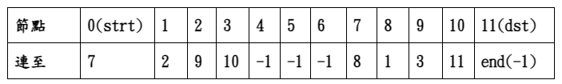
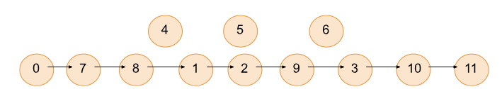
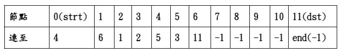
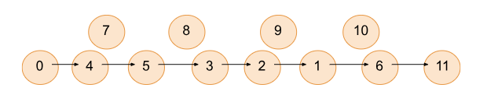
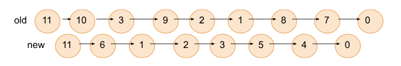
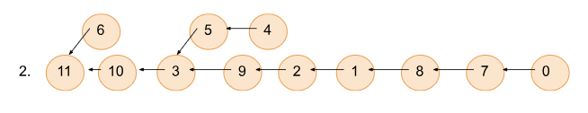
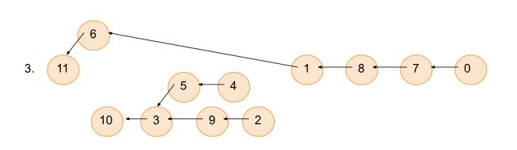
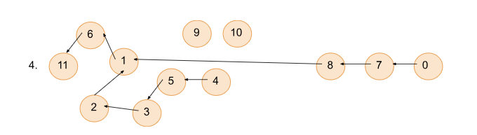
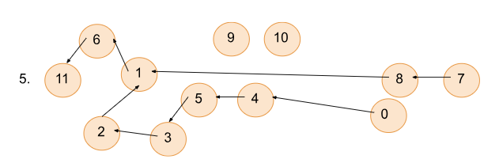
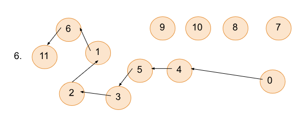

---
jupytext:
  text_representation:
    extension: .md
    format_name: myst
    format_version: 0.13
    jupytext_version: 1.16.2
kernelspec:
  display_name: Python 3 (ipykernel)
  language: python
  name: python3
---

# Routing Path Update


> **基本資訊**  
> 程式語言: C  
> 程式網址: https://onlinegdb.com/9OJzYnfzL  
> 製作時長: 2 周  
> 作者: Hutaki Hare  

## 題目簡介 
給定n個節點，並輸入舊的與要更新至的新的 routing path，將舊的path在不造成drop、cycle一步一步更新至新的path，且傳輸順序不可亂掉。  
 

## 運作方式
### 1.開始: 輸入n、新舊路徑


舊的路徑  




新的路徑  




```{code-block} c
---
vscode:
  languageId: c
---
scanf("%d",&n);                                   //scan node num
linked_list strt_arr[n],result_arr[n];
for(int i=0;i<n;i++){
    scanf("%d",&num);
    strt_arr[i].node=i;
    strt_arr[i].num=num;
}
for(int j=0;j<n;j++){                                   //store all in arr sequently
    scanf("%d",&num);
        result_arr[j].node=j;
        result_arr[j].num=num;
}
```

### 2. 過程
 1. 用stack的方式儲存兩個routing path  
 

```{code-cell} ipython3
---
vscode:
  languageId: c
---
for(int t=0;t!=-1;){                                  // put the used nodes in linked list in stack (LIFO)
    strt=add_to_list_normal(strt_arr[t].num,t,strt);
    t=strt_arr[t].num;
}
for(int t=0;t!=-1;){                                   // put the used nodes in linked list in stack
    result=add_to_list_normal(result_arr[t].num,t,result);
    t=result_arr[t].num;
}
```


 2. 先算一次更新次數，並印出，再一條一條印出更新過程
 

```{code-cell} ipython3
---
vscode:
  languageId: c
---
int count_fin(linked_list *strt,linked_list *result,linked_list *result_arr,linked_list *tmp_strt_arr,int n){   //count num of steps
    linked_list *tmp_re=result,*tmp_strt=strt,strt_arr[n];
    int count=1,non_used_assigned=0;   // "count" count the num of steps
    for(int i=0;i<n;i++){
       ...
        if((strt_arr[i].num==-1)&&(result_arr[i].num!=-1)){           //if have non used nodes, and what their next is not -1
            non_used_assigned=1;                    //count+=1 (update once assigning all node to -1)
            strt_arr[i].num=result_arr[i].num;     //assign all non used nodes to their right next node 
        }
    }
    count+=non_used_assigned;        //count+=0 if no non used nodes that need
    while(1){
        int non_release_need_count=0;          //count if need to do releasing nodes
        if(strt_arr[tmp_re->node].num!=tmp_re->num){         //due to stack,start with the destiny node, if dif go in loop
            count++;                             // 1.connection
            //connect now directly to the next node it should have (count+=1)
            if(tmp_strt->node!=tmp_re->node){       //if have non used nodes after the connection
                //from the strt list start, to the node working on now
                //if any of the release nodes shouldn't point to -1
                //if need to do update
                tmp_strt=tmp_store_tmp_strt;  //assign back to tmp_strt was
                if(non_release_need_count){   //if need to do updating
                    //assign the right next node
                    count+=(non_release_need_count);// 2.update non used nodes
                }
            }
        }
        if(tmp_re->node==0){              //if now is start node break out
            bool all_same=true;
            for(int i=0;i<n;i++){       //see if not yet all node well assigned
                if(strt_arr[i].num!=result_arr[i].num){
                    all_same=false;
                   break;
                }
            }
            if(!all_same){ //if not update once to all same 
                count++;
            }
            break;
        }
        tmp_re=tmp_re->next;             //go to next (the node before now)
    }
    return count;
}
```

3. 因為是stack的關係，所以由第一個看起時，實際上是從終點看起，由此將舊的
       path與新的path由後往前比對，在發現不同的節點時，若為使用中的點也可直接
       連至共通點，再繼續往下比較，若該新的點並未使用則直接將其連至共通的點則
       可一直繼續跟新的path做比較往後連，直到下一點是使用中的節點(因為未使用的
       節點沒有資訊drop的問題)，跟其連上後，原本連到共通點之間與新的path不同的
       點即可release至非使用終點，如此起始點資訊就不會drop，也不會產生cycle的
       問題  
  
  
  
  
  

```{code-cell} ipython3
---
vscode:
  languageId: c
---
void do_fin(linked_list *strt,linked_list *result,linked_list *result_arr,linked_list *strt_arr,int n){  //do the updates
    linked_list *tmp_re=result,*tmp_strt=strt->next;
    int non_used_assigned=0;
    for(int i=0;i<n-1;i++){
        if((strt_arr[i].num==-1)&&(result_arr[i].num!=-1)){             //if have non used nodes, and what their next is not -1
            non_used_assigned=1;                                    // have assign non used nodes =1
            strt_arr[i].num=result_arr[i].num;    //assign all non used nodes to their right next node 
        }
    }
    if(non_used_assigned){
        tranverse(strt_arr,n);           //if have update, print out
    }
    while(1){
        bool non_release_need_count=false;
        if(strt_arr[tmp_re->node].num!=tmp_re->num){       //due to stack,start with the destiny node, if dif go in loop
            strt_arr[tmp_re->node].num=result_arr[tmp_re->node].num;  //connect now directly to the next node it should have
            tranverse(strt_arr,n);           //print out the updates
            linked_list *tmp_store_tmp_strt=tmp_strt;
            if(tmp_strt->node!=tmp_re->node){    //if have no non used nodes after the connection
                while(tmp_strt->node!=tmp_re->node){   //from the strt list start, update till the node working on now
                    if((result_arr[tmp_strt->node].num!=-1)&&(strt_arr[tmp_strt->node].num!=result_arr[tmp_strt->node].num)){  // if all node to connect isn't all to -1
                        non_release_need_count=true;     //need to update
                        break;
                    }
                    tmp_strt=tmp_strt->next;      
                }
                tmp_strt=tmp_store_tmp_strt;          //point tmp_strt back
                if(non_release_need_count){         // if need update
                    while(tmp_strt->node!=tmp_re->node){       //update all between strt_arr to now
                        strt_arr[tmp_strt->node].num=result_arr[tmp_strt->node].num;
                        tmp_strt=tmp_strt->next;
                    }
                    tranverse(strt_arr,n);    //print out the new updates
                }
            }
        }
        if(tmp_re->node==0){        //if now is start node break out
            bool all_same=true;
            for(int i=0;i<n;i++){       //check if all same
                if(strt_arr[i].num!=result_arr[i].num){
                    all_same=false;
                    strt_arr[i].num=result_arr[i].num;
                }
            }
            if(!all_same){ //if not all same, fix it and print out
                tranverse(strt_arr,n);
            }
            break;
        }
        tmp_re=tmp_re->next;   //go to next (the node before now)
    }
}
```

### 3. 結果


```{code-cell} ipython3
---
vscode:
  languageId: c
---
//main
printf("%d\n",(count_fin(strt,result,result_arr,strt_arr,n)));     //print out the step num
tranverse(strt_arr,n);
if(!(compare(strt,result))){                        //if two list not same -> update
    do_fin(strt,result,result_arr,strt_arr,n);         // do updates
}

//function
void tranverse(linked_list *strt_arr,int n){            //print out arr
    for(int i=0;i<n;i++){
        if(i!=n-1){
            printf("%d ",(strt_arr)[i].num);
        }else{
            printf("%d\n",(strt_arr)[i].num);
        }
    }
}
```
