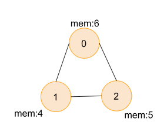
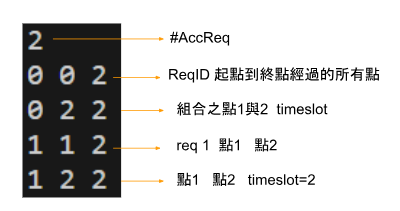
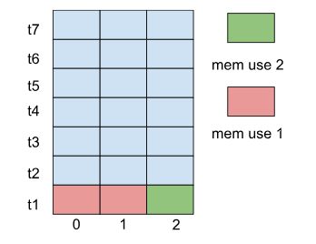
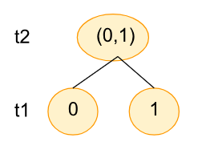
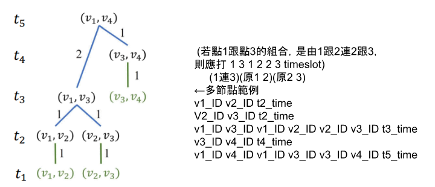

---
jupytext:
  formats: md:myst
  text_representation:
    extension: .md
    format_name: myst
    format_version: 0.13
    jupytext_version: 1.11.5
kernelspec:
  display_name: Python 3
  language: python
  name: python3
---
# Quantum Network

> **基本資訊**  
> 程式語言: C  
> 程式網址: https://onlinegdb.com/rSHjpgVN83  
> 製作時長: 2 周  
> 作者: Hutaki Hare  

## 題目簡介 
給定時間t與各個tasks要利用quantum network達成不同點的資料穿送，因為不同quantum  
所擁有的memory大小不同，在memory大小不夠時，便須錯開時間做entanglement與swapping  
，若無法在時間內完成該task，則可拒絕，並嘗試下一個task，在結果處印出接受的task數、  
task編碼、完成task的過程。    
  

## 運作方式
### 1.開始: 輸入時間、task、quantum info

```
int node_num,link_num,timeslot,request_num,time_count=0;
scanf("%d %d %d %d",&node_num,&link_num,&timeslot,&request_num);         //info scanning
...
int path_determine[request_num][node_num];   //store each node's distance with the request's distance
for(int i=0;i<node_num;i++){              //scan node
    scanf("%d %d",&node[i].node_id,&node[i].quantum_mem);
    node[i].next_node=NULL;
}
//reset path_determine to all not been yet (-1)
link_graph link[link_num];
for(int j=0;j<link_num;j++){              //scan link & connect nodes
    scanf("%d %d %d",&link[j].link_id,&link[j].link_end1,&link[j].link_end2);
    // enternal links, not count as mem
}
```
 &nbsp;&nbsp;
  

### 2. 過程
 1. 創造出兩個節點數*timeslot數的二為陣列紀錄各節點(quantum)的memory使用狀況
```
 int numerlogy_1[timeslot+50][node_num+50],numerlogy_2[timeslot+50][node_num+50];  //numerlogy graph to see the mem use
 ...

```

 2. 用for迴圈一個一個看任務，由BFS找出起點到終點的最短路徑
```
//main
for(int i=1;path_determine[now][tmp_node]!=0;i++){     //find path of src and dst, store in tree
    tree[now][i]=tmp_node;  
    connecting_node *tmp=node[tmp_node].next_node;
    tmp=sort(tmp,node_num);    //make tmp in small to big order
    while(tmp){
        if(path_determine[now][tmp->node_id]==(path_determine[now][tmp_node]-1)){
            tmp_node=tmp->node_id;
            if(path_determine[now][tmp->node_id]==0){
                i++;
                tree[now][0]=i;    //strt from 1 to tree[fin_request][0] (<=)
                tree[now][i]=tmp->node_id;
            }
            break;
        }
        tmp=tmp->next;   
    }
}

//function
int BFS(int i,int node_num,node_info* node,int request_src,int request_dst,int path_determine[][node_num]){     // find the distance between src and dst
    int last_node=request_dst;           //strt from dst
    node_info *tmp_node=&node[request_dst];       //connect to the node of dst
    connecting_node *stack=NULL,*rear=stack,*tmp_stack=tmp_node->next_node;   //find the stack next node of dst
    path_determine[i][last_node]=0;     //set the dst distance as 0
    while((stack!=NULL||last_node!=-1)||last_node==request_dst){ 
        while(tmp_stack!=NULL){
            connecting_node *tmp=malloc(sizeof(connecting_node));
            if(path_determine[i][tmp_stack->node_id]>(path_determine[i][last_node]+1)||(path_determine[i][tmp_stack->node_id])==-1){  //goes in only if never have been gone (-1), or there is shorter distance
                path_determine[i][tmp_stack->node_id]=(path_determine[i][last_node]+1); //assign distance
                tmp->node_id=tmp_stack->node_id;     //use  queue to add in new nodes
                tmp->last_node=last_node;
                tmp->next=NULL;
                if(stack!=NULL){
                    rear->next=tmp;
                    rear=tmp;
                }else{
                    stack=tmp;
                    rear=tmp;
                }
            }
            tmp_stack=tmp_stack->next;
        }
        last_node=pop(&stack);  //pop next num to look in the stack
        if(last_node==-1){
            stack=NULL;
        }
        tmp_node=&node[last_node]; // fin,change to next node in stack as strt
        tmp_stack=tmp_node->next_node;
    }
    return path_determine[i][request_src];    // return the distance of scr and dst
}

```

 3. 由起始點與下一個點一個一個連起做出一postorder的歪斜樹
```
 if(on_off&&((store_k+post_tree[now][0].time_slot-1)<=(timeslot))){   //if on_off==1 ->have find place to strt
    post_tree[now][0].strt_point=store_k;
    numerlogy_2[store_k-1][post_tree[now][1].strt_point]++;             //add first time mem
    numerlogy_2[store_k-1][post_tree[now][1].end_point]++;
    numerlogy_2[store_k][post_tree[now][1].strt_point]++;             //add second time mem
    numerlogy_2[store_k][post_tree[now][1].end_point]++;
    if(post_tree[now][0].time_slot>1){
        numerlogy_2[store_k-1][post_tree[now][2].strt_point]++;
        numerlogy_2[store_k-1][post_tree[now][2].end_point]++;
        numerlogy_2[store_k][post_tree[now][2].strt_point]++;
        numerlogy_2[store_k][post_tree[now][2].end_point]++;
        store_k++;
    }
    for(int strt=1,next=2;next<=post_tree[now][0].time_slot;next++){  // add mem
        numerlogy_2[store_k][post_tree[now][strt].strt_point]++;
        numerlogy_2[store_k][post_tree[now][next].end_point]++;
        if(next<post_tree[now][0].time_slot){
            store_k--;
            numerlogy_2[store_k][post_tree[now][next+1].strt_point]++;
            numerlogy_2[store_k][post_tree[now][next+1].end_point]++;
            store_k++;
            numerlogy_2[store_k][post_tree[now][next+1].strt_point]++;
            numerlogy_2[store_k][post_tree[now][next+1].end_point]++;
        }
        store_k++;
    }
...
}
```

 4. 判斷樹高是否超過所可以接受的timeslot高度，超過直接拒絕request換下一個，  
    若無則由t1開始比對memory看是否放得下新的entanglement，若不行則向上移去其  
    他空的時間點或拒絕  
```
int ok_numerlogy=1;
for(int k=2;k<=timeslot;k++){          //scan through all node see if mem isn't over
    for(int s=0;s<node_num;s++){
        if(numerlogy_2[k][s]>node[s].quantum_mem){
            ok_numerlogy=0;
            break;
        }
    }
    if(!ok_numerlogy){
        break;
    }
}

```

 5. 將成功經過判斷的request加入陣列中(numerlogy)，並與memory limit比較，若沒
    問題，則更新另一個陣列，若不通過則複製另一陣列(加入新樹前的)至本陣列(加
    入新樹後的)
```
if(!ok_numerlogy){     //over ->reject request
    continue;
}
for(int k=2;k<=timeslot;k++){         //success copy 2 to 1 numerlogy
    for(int s=0;s<node_num;s++){
        numerlogy_1[k][s]=numerlogy_2[k][s];
    }
}
fin_request_order[fin_request]=request[now].request_id;   //store request id
request[now].request_id=-1;                // done
fin_request++;                             //fin task count
```

### 3. 結果
印出達成的request數、request id、期點至終點之路徑、postorder traverse過程加經  
過的timeslot

```
printf("%d\n",fin_request);                 //req num
for(int i=0;i<fin_request;i++){ 
    printf("%d ",fin_request_order[i]);      //req_id
    for(int j=1;j<=tree[fin_request_order[i]][0];j++){   //path
        printf("%d ",tree[fin_request_order[i]][j]);
    }
    printf("\n");
    int now_slot=post_tree[fin_request_order[i]][0].strt_point;  //post order tree traverse
    printf("%d %d %d\n",post_tree[fin_request_order[i]][1].strt_point,post_tree[fin_request_order[i]][1].end_point,now_slot++);
    if(post_tree[fin_request_order[i]][0].time_slot>1){
        now_slot--;
        printf("%d %d %d\n",post_tree[fin_request_order[i]][2].strt_point,post_tree[fin_request_order[i]][2].end_point,now_slot++);
    }
    for(int strt=1,next=2;next<=post_tree[fin_request_order[i]][0].time_slot;next++){
        printf("%d %d %d %d %d %d %d\n",post_tree[fin_request_order[i]][strt].strt_point,post_tree[fin_request_order[i]][next].end_point,post_tree[fin_request_order[i]][strt].strt_point,post_tree[fin_request_order[i]][next-1].end_point,post_tree[fin_request_order[i]][next].strt_point,post_tree[fin_request_order[i]][next].end_point,now_slot);
        if(next<post_tree[fin_request_order[i]][0].time_slot){
            printf("%d %d %d\n",post_tree[fin_request_order[i]][next+1].strt_point,post_tree[fin_request_order[i]][next+1].end_point,now_slot++);
        }else{
            now_slot++;
        }
    }
}
```

  
  &nbsp;&nbsp;
  
  
